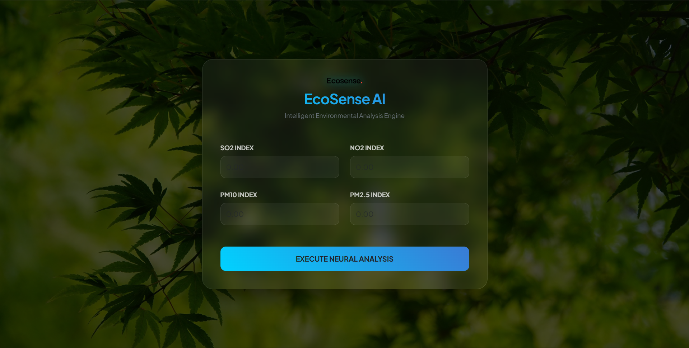

# EcoSense AI 🌿
**Intelligent Air Quality Classification System**

EcoSense AI is a full-stack environmental analysis platform that utilizes a **Random Forest Machine Learning model** to classify the Air Quality Index (AQI) based on real-world pollutant levels. The system achieves a high precision of **99.9% training accuracy**, delivering instant results through a modern, responsive web interface.

---

## 📸 Screenshot



*Modern Glassmorphism UI designed for intuitive data entry.*


---

## 🚀 Key Features
* **Predictive Accuracy**: Optimized Random Forest Classifier achieving **99.9% accuracy** on 500,000+ data points.
* **Real-time Processing**: Seamless integration between the ML model and **Flask backend** for low-latency inference.
* **Responsive Frontend**: Developed with **CSS Glassmorphism** and a natural-themed UI for a premium user experience.
* **Cloud Deployment**: Production-ready hosting on **Render** using a **Gunicorn WSGI server** for high availability.

---

## 🛠️ Tech Stack
* **Machine Learning**: Python, Scikit-Learn, Joblib, NumPy, Pandas.
* **Backend**: Flask (Python).
* **Frontend**: HTML5, CSS3 (Modern Glassmorphism).
* **Deployment & DevOps**: Git, GitHub Desktop, Render, Gunicorn.

---

## ⚙️ Installation & Usage

1. **Clone the Repository**:
   ```bash
   git clone https://github.com/sahil2345ps-lab/EcoSense_AI.git


2. **Setup Virtual Environment**:
   ```bash
   python -m venv venv
   source venv/Scripts/activate  # On Windows: venv\Scripts\activate

3. **Install Dependencies**:
    pip install -r requirements.txt   

4. **Run the Application**: 
    python app.py


📄 License
Copyright (c) 2026 Sahil

This project is licensed under the MIT License. You are free to use, modify, and distribute this software, provided that original credit is given to the author. This project was developed as an educational extension of environmental data analysis techniques.